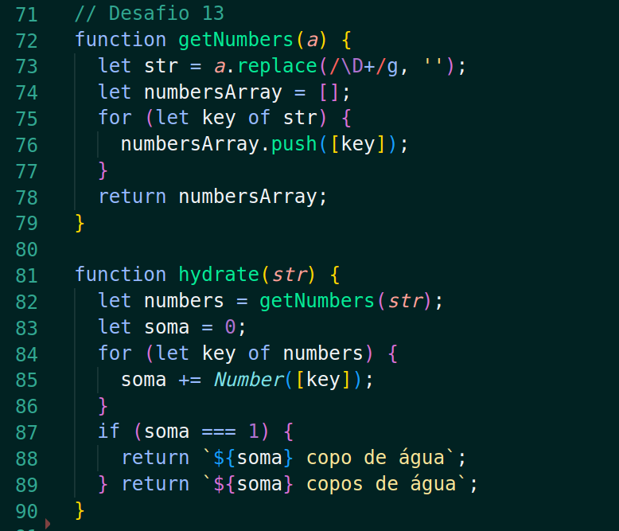

# O que é o projeto Playground Functions: 

Neste projeto, foram dados diversos desafios de lógica de programação, nos quais pude desenvolver as seguintes habilidades:

* Escrever códigos em JavaScript que usam variáveis e tipos primitivos;
* Utilizar conceitos da linguagem como a tipagem dinâmica e operadores lógicos/aritméticos/de atribuição no seu código;
* Criar códigos que usam estruturas condicionais, como o if/else ;
* Manipular arrays (listas);
* Utilizar o comando for ;
* Quebrar grandes problemas em pequenos;
* Utilizar a lógica de programação na resolução de problemas;
* Manipular objetos;
* Utilizar o comando for/in ;
* Utilizar funções para organizar e estruturar o seu código;

Abaixo, trago o exemplo do desafio 13, no qual a função recebe uma string com um pedido de bebidas e suas quantidades, e retorna um numero de copos de água igual ao total de bebidas solicitado. 

  